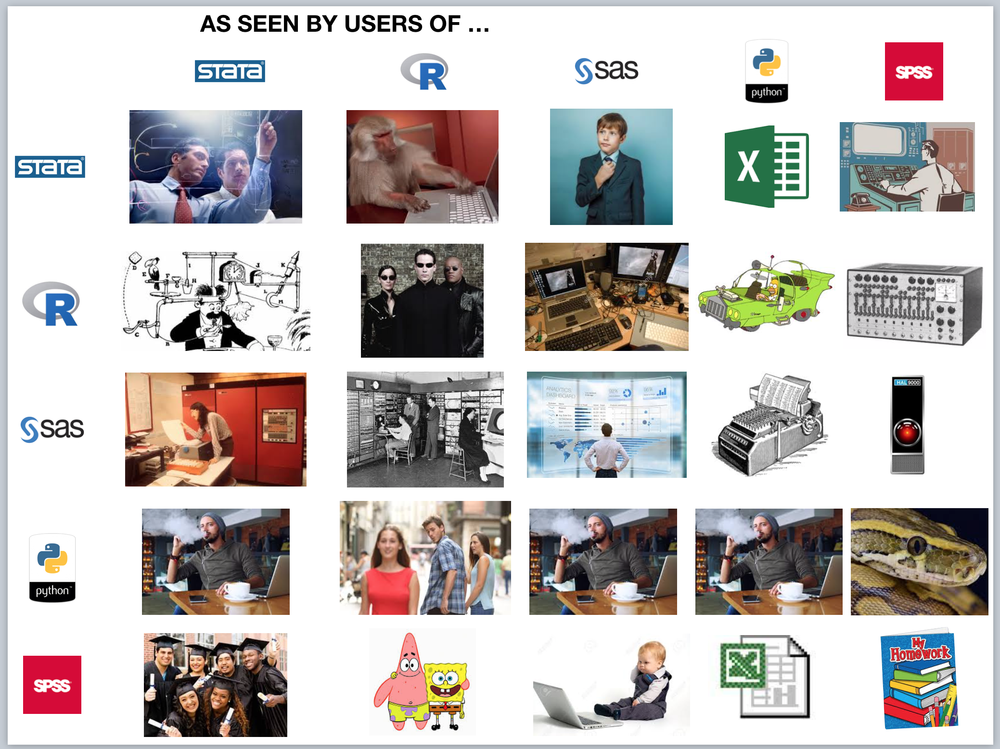

```{r setup, echo = FALSE, warning=FALSE, error=FALSE, warning=FALSE, include=FALSE}
library(tidyverse)
library(knitr)

opts_chunk$set(echo = FALSE, 
               fig.width = 12, fig.height = 8, 
               # fig.align = 'center', fig.show = 'hold', fig.path = 'figure/', fig.retina=3, 
               # cache = TRUE, cache.path = 'cache/',
               # external = TRUE, dev = 'svglite'
               # out.width = "100%", 
               warning = FALSE, message = FALSE, 
               comment = "#>",
               autodep = TRUE, hiline=TRUE)

knitr::opts_hooks$set(fig.callout = function(options) {
  if (options$fig.callout) {
    options$echo <- FALSE
    options$out.height <- "99%"
    options$fig.width <- 10
    options$fig.height <- 8
  }
  options
})

options(htmltools.dir.version = FALSE, 
        tibble.width = 60, 
        tibble.print_min = 6, 
        width = 80,
        max.print = 9999,
        knitr.table.format = "html")

as_table <- function(...) knitr::kable(..., format='html', digits = 0)
```


# Available tools 

.pull-left[

**Tools needed to do our jobs**;

- Audit tools
- BI tools
- Data science tools

]

--

.pull-right[

**Challenging issues**;

- Complex formula
- Not flexible
- Meet all your needs

]


---


# Audit tools 

.left-column[

[Source:] [2015 AuditNet Audit Data Analysis Software Survey](https://www.surveymonkey.com/results/SM-WYX6VMW2/)

]

.right-column[


]


---


# BI tools 

.pull-left[

Integrate with R or Python;

- [Microsoft (PowerBI, Azure)](https://docs.microsoft.com/en-us/power-bi/desktop-r-visuals)
- [Tableau](https://www.tableau.com/learn/whitepapers/using-r-and-tableau)
- [Qlik](https://community.qlik.com/t5/Qlik-Server-Side-Extensions/Qliksense-and-R-integration/td-p/1444562)
- [Rapidminer](https://docs.rapidminer.com/latest/studio/operators/utility/scripting/execute_r.html)
- Many others

]

--

.pull-right[

 

]


---


# Data science tools 


```{r out.width="60%", fig.align='center'}

```


[Source:] [Stats Package Wars](https://kieranhealy.org/blog/archives/2019/02/07/statswars/)


---


# Motivation 

.pull-left[

* Data analytics for external auditors | [ ICAEW](https://www.icaew.com/international-accounting-and-auditing/international-standards-auditing/auditing-standards-and-guidance/international-auditing-perspectives/data-analytics-for-external-auditors)
* Basic audit data analytics with R | [CPA Canada](https://www.cpacanada.ca/en/members-area/profession-news/2018/july/adas-practical-learning)
* Rutgers Accounting Research Center and Continuous Auditing & Reporting Lab | [ Rutgers](http://www.business.rutgers.edu/faculty/miklos-vasarhelyi)
* DIGAUDIT | [NHH](https://www.nhh.no/en/research-centres/digaudit/about-digaudit/)
* KPMG Master of Accounting with Data and Analytics Program | [ KPMG](https://home.kpmg/us/en/home/insights/2018/02/kpmg-master-of-accounting-with-data-and-analytics-program.html)

]

--

.pull-right[

[Spreadsheet workflows in R](https://education.rstudio.com/blog/2020/08/spreadsheets-using-r/), a good example shows you why you should use programming tools to do the audit job.

]


---


# Training course 

**Course structure**; 

1. Introduction: installation setup.  
2. Basic programming: R (Python), Base R (Pandas), Rmarkdown (Jupyter).
3. Tidyverse: clean, manipulate, visualize, functions, modeling, report.

**Learning objectives**; 

1. Understand basic programming.
2. Acquire intermediate data analytics skills in R.

**Course materials**; 


```{r}`r ''`
usethis::use_course("https://github.com/stewartli/ada_tutorial/archive/master.zip")
```

---


# Setup 

[Download R](https://www.r-project.org/)     
[Download RStudio](https://rstudio.com/products/rstudio/download/)     
Download packages   


```{r}`r ''`
pkgs <- c('tidyverse', 'data.table', 'kableExtra')
lapply(pkgs, install.packages)
pkgs %in% installed.packages()
```

---


# Demo 


```{r}`r ''`
rmarkdown::run("./tutorials/8_demo.Rmd")
```


---


# Contact us 


<br><br>


.font150.center[&#x1F914; &#x1F4A1; &#x1F913;]

.center[Stewart Li | stewartlisg@gmail.com] 

.center[China | Singapore | New Zealand] 


