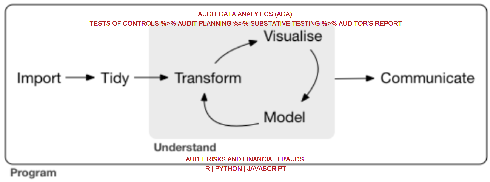

```{r setup, include = FALSE}
knitr::opts_chunk$set(echo = FALSE, warning = FALSE, error = FALSE, message = FALSE, 
                      results = "asis")

library(tidyverse)
library(kableExtra)
```


<head>
<link rel="stylesheet" href="https://pro.fontawesome.com/releases/v5.10.0/css/all.css" integrity="sha384-AYmEC3Yw5cVb3ZcuHtOA93w35dYTsvhLPVnYs9eStHfGJvOvKxVfELGroGkvsg+p" crossorigin="anonymous"/>
</head>


<div class="container">

<div class="paside">


<div class="paside_word">

Stewart Li, a qualified accountant, has extensive experience assisting organisations with strengthening internal controls processes, initial public offerings and IFRS reporting standards. He has worked closely with a wide variety of clients in the manufacturing, service and public sectors across the region. He is passionate about utilizing Data Analytics to help clients manage the financial reporting challenges associated with a constantly changing business environment. 

</div>

<i class="fas fa-user-secret"></i> Stewart Li ~MCom|CA|ACCA~ \
<i class="far fa-envelope"></i> stewardli8@msn.com \
<i class="fas fa-globe-americas"></i> https://raudit.netlify.com/ \
<i class="fas fa-map-marked-alt"></i> Clementi, Singapore \

</div>

<div class="pintro">

Accounting professionals tend to work under pressure so that they can cover as much ground as possible. However, tools at their disposal often have very limited power and are unable to optimistically fit their workflow. Furthermore, their work is prone to errors due to too many copy+paste and unreproduciblity.

In our view, **R** is a perfect tool to increases their productivity and conform to their workflow. Data analytics lifecycle described by [R4DS](https://r4ds.had.co.nz/) sensibly matchs audit routines. This document is meant to demonstrate the usefulness of R in the field of audit via a specific use case. 



**RAudit Solution LLP** leverages accounting expertise and the power of R to provide excellent consulting services to organisations across a diverse range of sectors. We help organisations like yours become more efficient and effective with auditing and forensic accounting. Contact us today for more about how consulting can help your organisation adapt to a rapidly changing market.

Our consulting will help you with: 

> Financial Planning & Analysis;    
> Internal Audit;       
> External Audit;   
> Practices of SOX and FCPA;    
> In-house Training;   

</div>

</div>


# Training course


This is an example of our training course. See [Github Repo](https://stewartli.github.io/ada_tutorial/) for details. 


**Data cleaning**

<hr>


```{r}
df <- read_csv(here::here('data/billboard_clean.csv'))

head(df, 25) %>%
  mutate(len = round(len, 0)) %>% 
  kable(
    # format.args = list(decimal.mark = '.', big.mark = ","),
    longtable = TRUE,
    booktabs = TRUE) %>%
  kable_styling(latex_options = c("striped", "hold_position", "repeat_header"), font_size = 10) %>%
  row_spec(0, bold = TRUE) %>%
  row_spec(c(10,20), bold = FALSE, color = "white", background = "coral") %>%
  footnote(general = "The first 25 rows of data",
           footnote_as_chunk = TRUE,
           title_format = c("italic"))
```


<br>


**Data munging**

<hr>


```{r}
best <- df %>% 
  group_by(artist, track) %>% 
  summarise(best_score = min(rank), 
            best_last = sum(rank == 1)) %>% 
  mutate(peak = ifelse(best_score == 1, 'best hit', 'no hit')) %>% 
  ungroup()

best %>% 
  filter(fct_lump(artist, 5, w = best_last) != 'Other') %>% 
  kable() %>% 
  kable_styling(full_width = F, font_size = 10) %>% 
  column_spec(1, bold = TRUE) %>% 
  collapse_rows(columns = c(1), valign = "top") %>% 
  footnote(general = "The best of five artists",
           footnote_as_chunk = TRUE,
           title_format = c("italic"))
```


<br><br>


**Visualization**

<hr>


```{r  out.width="95%", out.height="20%", fig.show='hold', fig.align='center'}
df %>% 
  count(artist, sort = TRUE) %>% 
  slice(1:5, (n()-5):n()) %>% 
  mutate(artist = fct_reorder(artist, n)) %>% 
  ggplot(aes(n, artist)) +
  geom_col(width = 0.6) +
  geom_text(aes(label = n), nudge_x = 2, color = '#F11B59', alpha = .6, size = 3) +
  scale_x_continuous(limits = c(0, 110), expand = c(0, 0)) +
  scale_y_discrete(expand = c(0, 0)) +
  labs(title = paste0("<b><span style = 'font-size:20pt'>Artists Frequently",
                      "<span style = 'color:#F11B59;'> ",
                      "**Appear On Billboard**",
                      "</span></span></b>",
                      "<br><b><span style = 'font-size:14pt'>",
                      "*Top 5 and Bottom 5 Artists*",
                      "</span></b><br>"), 
       caption = "RAuidt Solution LLP | Stewart Li", 
       x = "", 
       y = "") +
  ggtext::geom_richtext(data = . %>%
                          summarise(the_mean = round(mean(n)), 0),
                        aes(x = the_mean,
                            y = "Ghostface Killah", 
                            label = glue::glue("*mean of frequency* = {the_mean}")), 
                        fill = NA, 
                        label.color = NA,
                        size = 2, 
                        angle = -90) +
  theme_minimal() +
  theme(
    plot.margin = margin(35, 35, 10, 35), 
    plot.title = ggtext::element_textbox_simple(
      size = 13,
      face = NULL,
      lineheight = 1.75,
      padding = margin(5, 5, 0, 5),
      margin = margin(0, 0, 0, 0),
      fill = "white"), 
    plot.title.position = "plot", 
    plot.caption = ggtext::element_textbox_simple(
      size = 10,
      lineheight = 1,
      padding = margin(10, 10, 10, 10),
      margin = margin(10, 0, 10, 0),
      fill = "#F5F5F5",
      halign = 0.5,
      valign = 0.5)
  )
```


**Modeling**

<hr>


```{r  out.width="95%", out.height="20%", fig.show='hold', fig.align='center'}
library(modelsummary)

lm1 <- lm(rank ~ len, data = df)
lm2 <- lm(rank ~ len + week, data = df)
lm3 <- lm(rank ~ len + week + date, data = df)

mod_list <- list("Model 1" = lm1, "Model 2" = lm2, "Model 3" = lm3)

msummary(mod_list, stars = TRUE) %>% 
  kable_styling(full_width = F, font_size = 10) %>% 
  row_spec(c(2, 4, 6), background = 'coral')
```


$~$  

$~$  

$~$  

$~$  

$~$  

$~$  

$~$  


<div class="end">

&copy;RAudit Solution LLP All rights reserved. \
China | Singapore | New Zealand <br>

Disclaimer: The document proudly produced by R is designed to be a general representation of the projects and is not in any way designed to represent views from any particular aspects. Views may be obstructed as some procedures otherwise are required by regulations under a certain circumstance. Contact RAudit Solution LLP for consulting services at your specific direction.


</div>


