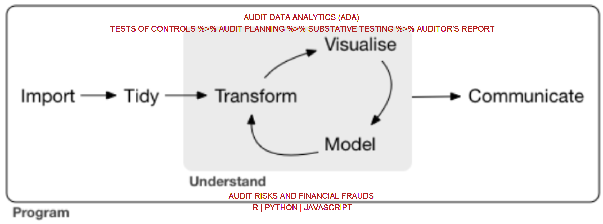

```{r setup, include=FALSE, echo=FALSE, warning=FALSE, message=FALSE, error=FALSE}

library(tidyverse)
library(crosstalk)
library(plotly)
library(reactable)
library(sparkline)
library(htmltools)
library(flexdashboard)
```


<style>
  :root {
    --bg-color: #2B5A72;
    --ptext-color: #D7E1E7; 
    --stext-color: #E2B755; 
  }
  .navbar {
    background-color: var(--bg-color);
    border-color: var(--stext-color);
  }
  .navbar-inverse .navbar-brand{
    color: var(--stext-color);
  }
  .navbar-inverse .navbar-nav > li > a{
    color: var(--stext-color);
  }
  .navbar-inverse .navbar-nav>.active>a, 
  .navbar-inverse .navbar-nav>.active>a:hover, 
  .navbar-inverse .navbar-nav>.active>a:focus {
    color: var(--stext-color);
  }
  .navbar-logo img{
    width: 25%;
  }
  #sidebar{
    background-color: var(--bg-color);
    color: var(--ptext-color);
  }
  .pics{
    display: flex;
    justify-content: flex-end;
    align-items: center;
  }
</style>


```{r include=FALSE}
df <- mtcars %>% 
  as_tibble(rownames = "car") %>% 
  mutate(across(c(am, gear, carb), as.factor))

sharedf1 <- SharedData$new(df %>% select(car, am, gear, carb, mpg, hp, disp), 
                           key = ~car, group = "group") # instead of join, 
```


Sidebar {.sidebar}
=====================================


<div>

**RAudit Solution LLP** leverages accounting expertise and the power of R to provide excellent consulting services to organisations across a diverse range of sectors. We help organisations like yours become more efficient and effective with auditing and forensic accounting. Contact us today for more about how consulting can help your organisation adapt to a rapidly changing market.

**Stewart Li**, a qualified accountant, has extensive experience assisting organisations with strengthening internal controls processes, initial public offerings and IFRS reporting standards. He has worked closely with a wide variety of clients in the manufacturing, service and public sectors across the region. He is passionate about utilizing Data Analytics to help clients manage the financial reporting challenges associated with a constantly changing business environment. 

</div>


<br><br>


<div class="pics">


</div>


Page 1 {data-navmenu="Content"} 
=====================================  


<h3>Audit Data Analytics (ADA) - Focus on risks efficiently and effectively</h3>


**Accounting professionals** tend to work under pressure so that they can cover as much ground as possible. However, tools at their disposal often have very limited power and are unable to optimistically fit their workflow. Furthermore, their work is prone to errors due to too many copy+paste and unreproduciblity.

In our view, **R** is a perfect tool to increases their productivity and conform to their workflow. Data analytics lifecycle described by [R4DS](https://r4ds.had.co.nz/) sensibly matchs audit routines. This document is meant to demonstrate the usefulness of R in the field of audit via a specific use case. 

**Our services** include Financial Planning & Analysis, Internal Audit, Forensic Accounting, External Audit, Training. 

**Our training course** include [Introduction](https://github.com/stewartli/ada_tutorial/blob/master/tutorials/0_introduction.pdf), [Programming](https://github.com/stewartli/ada_tutorial/blob/master/tutorials/1_programming_r.Rmd), [Cleaning](https://github.com/stewartli/ada_tutorial/blob/master/tutorials/4_cleaning.Rmd), [Manipulaiton](https://github.com/stewartli/ada_tutorial/blob/master/tutorials/3_manipulation.Rmd), [Visualization](https://github.com/stewartli/ada_tutorial/blob/master/tutorials/2_visulization.Rmd), [Functions](https://github.com/stewartli/ada_tutorial/blob/master/tutorials/5_function.Rmd), [Modling](https://github.com/stewartli/ada_tutorial/blob/master/tutorials/6_model.Rmd), and [Report](https://github.com/stewartli/ada_tutorial/blob/master/tutorials/7_report.pdf). 


See an interactive example on [Page 2]. <br>
<!-- Click [Page Two](#page-2). -->





Page 2 {data-orientation=rows, data-navmenu="Content"} 
=====================================    


Row {data-height=400}
-----------------------------------------------------------------------


### Scatterplot (mpg/hp)


```{r}
gg1 <- sharedf1 %>% 
  ggplot(aes(mpg, hp, color = am)) +
  geom_point() +
  labs(x = "MPG", 
       y = "HP") +
  theme_light()

ggly1 <- ggplotly(gg1, 
                  tooltip = c("mpg", "hp")) %>% 
  highlight(on = "plotly_selected",
            off = "plotly_doubleclick") %>% 
  layout(showlegend = FALSE)

ggly1
```

<!-- > Explore the relationship among `mpg`, `hp` and `disp`.  -->


### Scatterplot (disp/hp)


```{r}
gg2 <- sharedf1 %>% 
  ggplot(aes(disp, hp, color = am)) +
  geom_point() +
  labs(x = "DISP", 
       y = "HP") +
  theme_light()

ggly2 <- ggplotly(gg2, 
                  tooltip = c("disp", "hp")) %>% 
  highlight(on = "plotly_selected",
            off = "plotly_doubleclick") %>% 
  layout(showlegend = FALSE)

ggly2
```


Row {data-height=600}
-----------------------------------------------------------------------


### Interactive table


```{r}
tb <- reactable(sharedf1,
                bordered = FALSE,
                highlight = TRUE, 
                # searchable = TRUE,
                filterable = FALSE,
                selection = "multiple",
                onClick = "select",
                rowStyle = list(cursor = "pointer"),
                showPageSizeOptions = TRUE,
                minRows = 10, 
                fullWidth = TRUE,
                # groupBy = "am",
                defaultSorted = c("mpg"), 
                defaultColDef = colDef(
                  header = function(value) toupper(value),
                  cell = function(value) format(value, nsmall = 1),
                  align = "right",
                  minWidth = 70,
                  headerStyle = list(background = "#f7f7f8"), 
                  footer = function(values) {
                    if (!is.numeric(values)) return()
                    sparkline(values, type = "box", width = 60, height = 20)
                  }
                ), 
                columns = list(
                  car = colDef(filterable = TRUE, 
                               minWidth = 130)
                  # mpg = colDef(aggregate = "max"), 
                  # hp = colDef(aggregate = "max"),
                  # disp = colDef(aggregate = "max")
                ), 
                # columnGroups = list(
                #   colGroup(name = "Categorical", columns = c("gear", "carb")),
                #   colGroup(name = "Numeric", columns = c("mpg", "hp", "disp"))
                # ), 
                theme = reactableTheme(
                  highlightColor = "#E2B755",
                  headerStyle = list(borderColor = "#555")
                )
)
```


```{r}
slider1 <- bscols(filter_slider("mpg", "MPG", sharedf1, ~mpg))
slider2 <- bscols(filter_slider("hp", "HP", sharedf1, ~hp))
slider3 <- bscols(filter_slider("disp", "DISP", sharedf1, ~disp))

sliders <- bscols(slider1, slider2, slider3)

bscols(widths = c(12, 12), sliders, tb)
```


